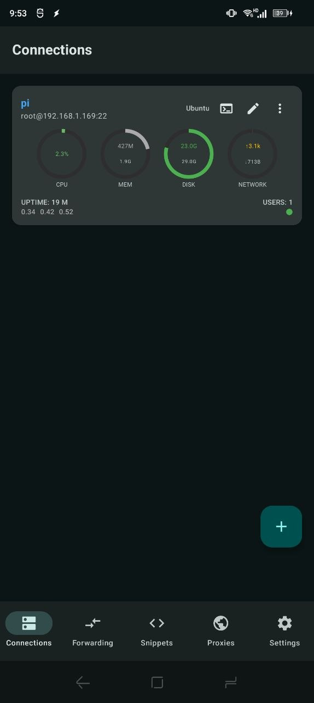
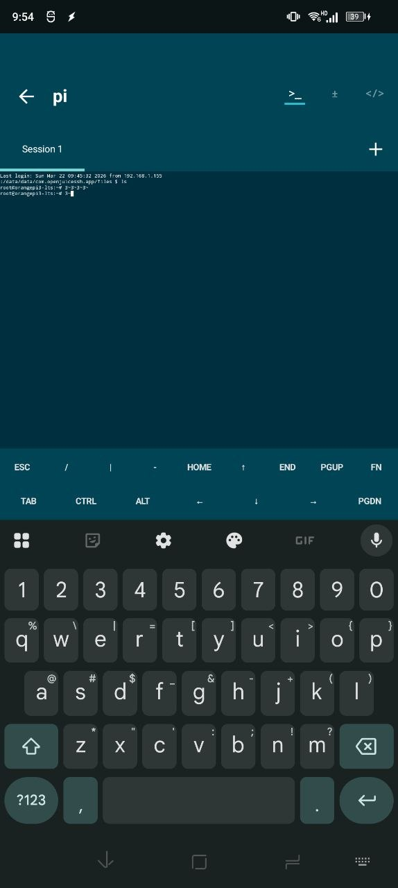
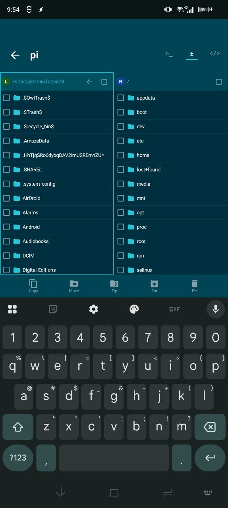

# OpenJuiceSSH 📱⚡

**OpenJuiceSSH** is a modern, open-source SSH and Telnet client for Android, inspired by the classic JuiceSSH and DaRemote experience. 
It aims to bring back the clean, intuitive terminal interface that developers loved, while modernizing the backend for better performance and security on newer Android versions.

---

## ✨ Features

* **Identity Management:** Define your ssh keys once and map them to multiple connections effortlessly.
* **Terminal Optimization:** A dedicated "popup" keyboard containing essential keys like `Ctrl`, `Alt`, `Tab`, `Esc`, and arrow keys.
* **SSH Proxy (Jump Host) Support:** Securely connect to internal servers by routing your traffic through a gateway/bastion host.
* **Port Forwarding:** Support for Local, Remote, and Dynamic (SOCKS) port forwarding to tunnel traffic through your SSH connections.
* **Modern SSH Support:** Updated encryption standards to ensure compatibility with modern OpenSSH servers.
* **Local Shell:** Access the underlying Android shell directly within the app.
* **Open Source:** Built by the community, for the community. No trackers, no delisting risks.

---

## 📸 Screenshots

| Connections | Terminal | File Manager | Proxies |
| :---: | :---: | :---: | :---: |
|  |  |  |  |

---

## 🚀 Getting Started

### Installation
1. Download the latest APK from the [Releases](https://github.com/YOUR_USERNAME/OpenJuiceSSH/releases) page.
2. Enable "Install from Unknown Sources" in your Android settings.
3. Open the APK and enjoy a classic terminal experience.

### Usage
To set up key-based authentication:
1. Generate an SSH key in the **Identity Management** section.
2. Copy the public key to your clipboard.
3. Add the key to your server's authorized list by running:
   ```bash
   echo "<copied key>" >> ~/.ssh/authorized_keys
   ```

---

## 🛠️ Built With
* **Kotlin** - Primary language for modern Android development.
* **JSch / sshj** - (Or specify your SSH library here) for secure terminal sessions.
* **Jetpack Compose** - For a smooth, reactive UI.

---

## 📜 License
Distributed under the **MIT License**. See `LICENSE` for more information.